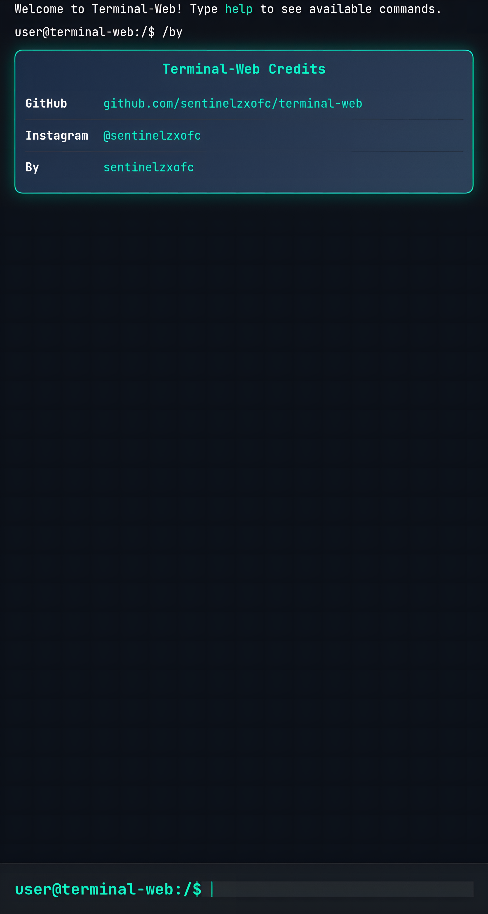

<p align="center">
  
</p>

<h1 align="center">Terminal-Web 🚀</h1>

<p align="center">
  <a href="https://sentinelzxofc.github.io/terminal-web/" target="_blank">
    
  </a>
  <br/>
  
  
  
</p>

<p align="center">
  
</p>

<p align="center">
  <b>A sleek, browser-based terminal emulator built with HTML, CSS, and JavaScript. ✨</b>
  <br/>
  Experience the power of a command-line interface in your browser with modern features, themes, and a virtual file system.
</p>

---

## 🌟 About

**Terminal-Web** is a fully functional, web-based terminal emulator designed to bring the command-line experience to your browser. With a modern UI, customizable themes, and a robust virtual file system, it’s perfect for developers, learners, and tech enthusiasts who want to explore terminal commands in a fun and interactive way.

Built with 💻 **HTML**, 🎨 **CSS**, and ⚙️ **JavaScript**, Terminal-Web supports a variety of commands, a nano-like editor with syntax highlighting, and an intuitive interface that mimics real-world terminals.

---

## 🔥 Features

- 🖥️ **Interactive Terminal**: Execute commands like `ls`, `cd`, `mkdir`, `cat`, `nano`, and more.
- 📂 **Virtual File System**: Create, edit, move, and delete files and directories in a browser-based environment.
- 🎨 **Customizable Themes**: Choose from `dark`, `light`, `hacker`, or `retro` themes.
- ✍️ **Nano Editor**: Edit files with syntax highlighting for JavaScript, Python, HTML, CSS, TypeScript, JSON, and Bash.
- 🚀 **New Commands**:
  - `pwd`: Print working directory.
  - `mv`: Move/rename files or directories.
  - `cp`: Copy files or directories.
  - `echo`: Print text to the terminal.
- 🌐 **API Integrations**: Fetch IP, quotes, weather, and ping websites.
- 📱 **Responsive Design**: Works seamlessly on desktop and mobile devices.
- ⚡ **Autocomplete**: Tab to suggest commands.
- 🖱️ **Toolbar Actions**: Toggle themes, fullscreen, and access help with a click.

---

## 🛠️ Installation

1. **Clone the Repository**:
   ```bash
   git clone https://github.com/sentinelzxofc/terminal-web.git
   cd terminal-web
   ```

2. **Serve Locally**:
   Use a local server (e.g., `http-server`):
   ```bash
   npm install -g http-server
   http-server .
   ```
   Open `http://localhost:8080` in your browser.

3. **Deploy to GitHub Pages** (optional):
   - Push to the `gh-pages` branch or configure GitHub Pages in the repository settings.
   - Access at `https://sentinelzxofc.github.io/terminal-web/`.

---

## 🚀 Usage

1. Open the terminal in your browser.
2. Type `help` to see available commands:
   ```bash
   user@terminal-web:/$ help
   ```
3. Try some commands:
   ```bash
   user@terminal-web:/$ mkdir project
   user@terminal-web:/$ cd project
   user@terminal-web:/project$ touch main.js
   user@terminal-web:/project$ nano main.js
   ```
4. Use the nano editor to write code, save with `Ctrl+S`, and exit.
5. Explore themes:
   ```bash
   user@terminal-web:/$ theme hacker
   ```

<p align="center">
  
</p>

---

## 📦 Dependencies

- [Axios](https://axios-http.com/) for API calls.
- [Figlet.js](https://github.com/patorjk/figlet.js) for ASCII art.
- [Highlight.js](https://highlightjs.org/) for syntax highlighting.
- [Material Icons](https://fonts.google.com/icons) for UI icons.

---

## 🤝 Contributing

Contributions are encouraged! 🙌 Follow these steps:

1. Fork the repository.
2. Create a feature branch: `git checkout -b feature-name`.
3. Commit your changes: `git commit -m "Add feature"`.
4. Push to the branch: `git push origin feature-name`.
5. Open a pull request.

---

## 📜 License

This project is licensed under the MIT License. See the [LICENSE](LICENSE) file for details.

---

## 🌐 Connect

- **GitHub**: [sentinelzxofc](https://github.com/sentinelzxofc)
- **Instagram**: [@sentinelzxofc](https://www.instagram.com/sentinelzxofc)
- **By**: sentinelzx

<p align="center">
  <a href="https://sentinelzxofc.github.io/terminal-web/" target="_blank">
    
  </a>
</p>

<p align="center">
  <b>Happy hacking! 💾</b>
</p>
